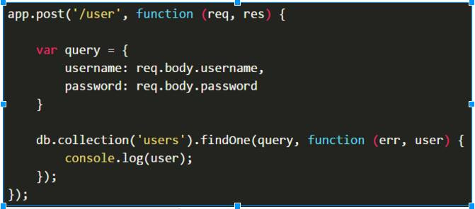
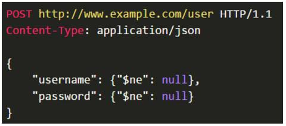
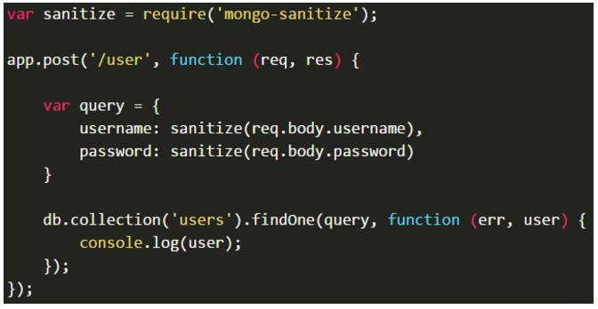
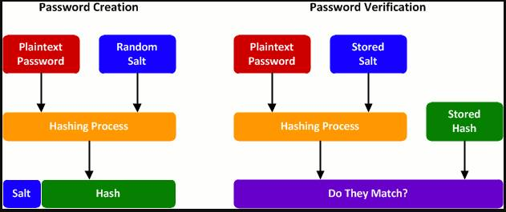

# Period-6 Security and how to secure Node/Express/REST-Backends 
 
### The exercise for this period is here: [Security Exercise](https://docs.google.com/document/d/1ZY-pZDQfwEoQlVk0Qn-lKnpa40MOl-hQdGW9Fx2A5XE/edit)

### Instructions
- The first thing you have to do is run a local mongoDB, when that is done run the file createDummyUser.js inside the rout-ex-react-back. This creates two users: `username: Michael, password: mich123` and `username: Christian, password: chris321`.
- bcrypt is used for the passwords to hash them and then salted like described [here](https://stackoverflow.com/questions/6832445/how-can-bcrypt-have-built-in-salts)
- JWT is used for this application. The serversecret is inside the index.js file and isn't hidden, will be later on (maybe).
- Helmet is used a little in the backend express server.
- To test the security, try adding a book without being logged in, then try it again while logged in. Update and delete is added aswell but for some reason it won't show the details window, will try and fix it later some day.
- The backend and the frontend has been checked with [nsp](https://nodesecurity.io/), here is the proof:

backend/frontend:


## Learning goals:
>## Explain basic security terms like authentication, authorization, confidentiality, integrity, SSL/TLS and provide examples of how you have used them.

#### Authentication: 
the process or action of proving or showing something to be true, genuine, or valid.
 
#### Authorization: 
Authorization is the function of specifying access rights to resources related to information security and computer security in general and to access control in particular. More formally, "to authorize" is to define an access policy. For example, human resources staff is normally authorized to access employee records and this policy is usually formalized as access control rules in a computer system.
 
#### Confidentiality:
The state of keeping or being kept secret or private.
In information security, confidentiality "is the property, that information is not made available or disclosed to unauthorized individuals, entities, or processes"
 
#### Integrity:
In information security, data integrity means maintaining and assuring the accuracy and completeness of data over its entire life-cycle. This means that data cannot be modified in an unauthorized or undetected manner. This is not the same thing as referential integrity in databases, although it can be viewed as a special case of consistency as understood in the classic ACID model of transaction processing. Information security systems typically provide message integrity in addition to data confidentiality.
 
#### SSL/TLS:
Transport Layer Security (TLS) and its predecessor, Secure Sockets Layer (SSL), both frequently referred to as "SSL", are cryptographic protocols that provide communications security over a computer network. Several versions of the protocols find widespread use in applications such as web browsing, email, Internet faxing, instant messaging, and voice-over-IP (VoIP). Websites use TLS to secure all communications between their servers and web browsers.
The Transport Layer Security protocol aims primarily to provide privacy and data integrity between two communicating computer applications. When secured by TLS, connections between a client (e.g., a web browser) and a server (e.g., wikipedia.org) have one or more of the following properties:
 
#### Example is the big exercise seed we have made for this period: [Seed-exercise](https://github.com/KongBoje/Hand-in-6-Security/tree/master/ReactExRoutBooksAuth).

---

>## How can we "prevent" third party code used, by either our Java or NodeJS applications, from injecting dangerous code into our code base?

By removing code tags from text. Don't let users try to insert code into the database.

'Sanitization' is the removal of malicious data from user input, such as form submissions or maybe more simply...

The cleaning of user input to avoid code-conflicts (duplicate ids for instance), security issues (xss codes etc), or other issues that might arise from non-standardized input & human error/deviance.

Depending on the context, sanitization will take on a few different forms.<br />
Could be as simple as removing vulgarities & odd symbols from text to removing SQL injection attempts and other malicious code intrusion attempts.


---

>## Explain about Node tools like Helmet and nsp (and the Node Security Project). What do they do, and how have you used them.

#### Helmet:
Helmet can help protect your app from some well-known web vulnerabilities by setting HTTP headers appropriately.

Helmet is actually just a collection of nine smaller middleware functions that set security-related HTTP headers:
- **csp** sets the Content-Security-Policy header to help prevent cross-site scripting attacks and other cross-site injections.
- **hidePoweredBy** removes the X-Powered-By header (Attackers can use this header (which is enabled by default) to detect apps running Express and then launch specifically-targeted attacks).
- **hpkp** Adds Public Key Pinning headers to prevent man-in-the-middle attacks with forged certificates.
- **hsts** sets Strict-Transport-Security header that enforces secure (HTTP over SSL/TLS) connections to the server.
- **ieNoOpen** sets X-Download-Options for IE8+.
- **noCache** sets Cache-Control and Pragma headers to disable client-side caching.
- **noSniff** sets X-Content-Type-Options to prevent browsers from MIME-sniffing a response away from the declared content-type.
- **frameguard** sets the X-Frame-Options header to provide clickjacking protection.
- **xssFilter** sets X-XSS-Protection to enable the Cross-site scripting (XSS) filter in most recent web browsers.

Install Helmet like any other module:<br />
**$ npm install --save helmet**


Then to use it in your code:
```javascript
var helmet = require('helmet')
app.use(helmet())
```

#### NSP:
NSP stands for Node Security Platform, which adds security checks right into your pull requests.<br />
Homepage: [NSP](https://nodesecurity.io/)

NSP checks the list of middleware and can know if there are vulnerabilities in them. 
Use "NSP CHECK" to check.
 
Nsp check example:


---

>## Explain basic security threads like: Cross Site Scripting (XSS), SQL Injection and whether something similar to SQL injection is possible with NoSQL databases like MongoDB, and DOS-attacks. Explain/demonstrate ways to cope with these problems, preferably via your suggestion for a seed.

#### XSS:
Cross-site scripting (XSS) is a type of computer security vulnerability typically found in web applications. XSS enables attackers to inject client-side scripts into web pages viewed by other users. A cross-site scripting vulnerability may be used by attackers to bypass access controls such as the same-origin policy. Cross-site scripting carried out on websites accounted for roughly 84% of all security vulnerabilities documented by Symantec as of 2007. Their effect may range from a petty nuisance to a significant security risk, depending on the sensitivity of the data handled by the vulnerable site and the nature of any security mitigation implemented by the site's owner.
 
#### SQL Injection:
SQL Injection is a code injection technique, used to attack data-driven applications, in which nefarious SQL statements are inserted into an entry field for execution (e.g. to dump the database contents to the attacker). SQL injection must exploit a security vulnerability in an application's software, for example, when user input is either incorrectly filtered for string literal escape characters embedded in SQL statements or user input is not strongly typed and unexpectedly executed. SQL injection is mostly known as an attack vector for websites but can be used to attack any type of SQL database.
SQL injection attacks allow attackers to spoof identity, tamper with existing data, cause repudiation issues such as voiding transactions or changing balances, allow the complete disclosure of all data on the system, destroy the data or make it otherwise unavailable, and become administrators of the database server.
In a 2012 study, it was observed that the average web application received 4 attack campaigns per month, and retailers received twice as many attacks as other industries.

#### SQL injection with MongoDB:
Is it possible?<br />
Yes it is.

NoSQL Injection is the equivalent for the NoSQL world. The attack tries to inject code when the inputs are not sanitized and the solution is simply to sanitize them before using.

For example, using Node.js and MongoDB:<br />


Let's suppose that we receive the following request:<br />


As **$ne** is the "not equal" operator, this request would return the first user (possibly an admin) without knowing its name or password.
The solution in this case is to sanitize(or to clean) the input before using them. A good options is [mongo-sanitize](https://github.com/vkarpov15/mongo-sanitize):


If you are using Mongoose, you don't need to sanitize the inputs. In this case, you just need to set the properties to be typed as string. If someone passes an object like **{ $ne: null }**, Mongoose will convert it to a string and no harm will be done.
 
#### DOS attacks: 
Denial of service is what makes a service very slow.<br />
DOS attacks mainly comes from bots or what you call zombie computers, which completely overflows the service with useless data.<br />
**ISPs** (Internet Service Providers such as TDC) may have to “null route” the victim, there is not much you can do.<br />
You can try banning/filtering ips but it will only cut down on the traffic, not stop it.

---

>## Explain and demonstrate ways to protect user passwords on our backend, and why this is necessary.


**Hashing and salting.** 

**Hashes** are one-way functions that generate a representation, usually a number, of the data put in to them. They always generate the same hash from the same data, and there is no simple way to reverse the process.<br />
you cannot recover a password just by looking at the hash.

This makes them incredibly useful for password storage. Instead of storing a user's password, you can store the hash of the password.<br /> When a user logs in again, instead of checking the password they type in against the one you have stored, you calculate the hash of the password they type in and compare that to the stored hash.<br />
It's possible though for you to make a database of hashes and the source passwords to try to recover them. 

There are lots of different hashing algorythms, the most commonly used being MD5 and SHA1, but outdated compared to bcrypt.

**Salting** is to hash more than just the user's password which means they all need a new hash, and it will be harder to create such a database of hashes.<br />
For example, instead of storing a hash of a user's password, you could store the hash of their email address and their password together.

This is effective because tables of hashes of generated data of more than about 10 characters start to become problematic to generate and store. At around that point, tables must be generated based upon dictionaries and known words, rather than on programatically generated lists of all possible passwords in a range.

The average length of "email plus password" is easily in the region of 25 characters. Not only that, but if someone worked out that you were using hashes of "email plus password", they would still need to generate a new table for every password they wanted to dehash.

This would make it too complex even for the more experienced hackers to try and extract data from.

---

>## Explain about password hashing, salts and the difference between Bcrypt and older (not suited) algorithms like sha1, md5 etc.
SHA1 and MD5 are cryptographic hashing algorithms. It is basically a super weird representation of the string. The original information is there, but is scrambled into something unintelligible. They go only one way. You take a string like “computer” and it becomes “df53ca268240ca76670c8566ee54568a” in MD5. However you can actually just precompute all combination of these and make a database of solutions to hashes. If you salt the passwords, then someone would have to re-compute the entire set of hashes for that salt.
 
SHA-1 produces a 160-bit (20-byte) hash value known as a message digest(the output aka. The hash value or hash)
 
The MD5 algorithm is a widely used hash function producing a 128-bit hash value.
 
Bcrypt is like sha1 and md5, but much slower. This makes it more time consuming to crack hashes. So there is actually no complete security, but the hackers will be held at bay for so long that it hopefully won’t matter by then (after maybe 100000 years)

---

>## Explain about JSON Web Tokens (jwt) and why they are extremely suited for a REST-based API
JSON Web Token (JWT) is a JSON-based open standard for creating access tokens that assert some number of claims. For example, a server could generate a token that has the claim "logged in as admin" and provide that to a client. The client could then use that token to prove that it is logged in as admin. The tokens are signed by the server's key, so the client and server are both able to verify that the token is legitimate. The tokens are designed to be compact, URL-safe and usable especially in web browser single sign-on (SSO) context. JWT claims can be typically used to pass identity of authenticated users between an identity provider and a service provider, or any other type of claims as required by business processes. The tokens can also be authenticated and encrypted.

---

>## Explain and demonstrate a basic NodeJS/React application and how it handles authentication, authorization, prevents against Cross Site Scripting and other basic web-threats.
Here we will show the exercise we made with the books, just with security now.
 
The only thing we haven’t made on the project or exercise is that it can prevent XSS, but to do it you should ensure you don’t let people put plain code into your database.

The app is here: [Seed-Exercise](https://github.com/KongBoje/Hand-in-6-Security/tree/master/ReactExRoutBooksAuth)
